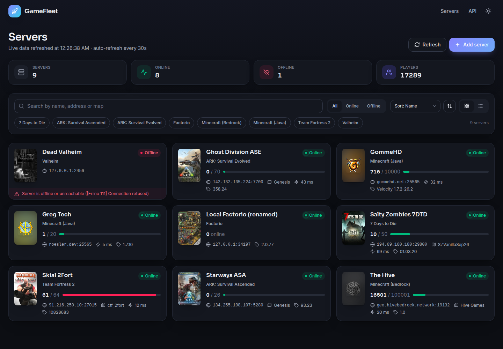
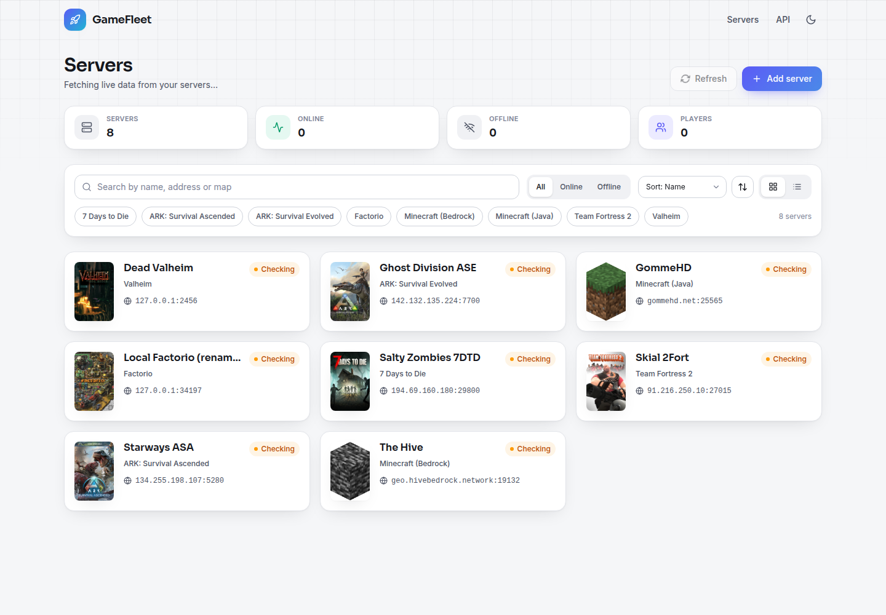
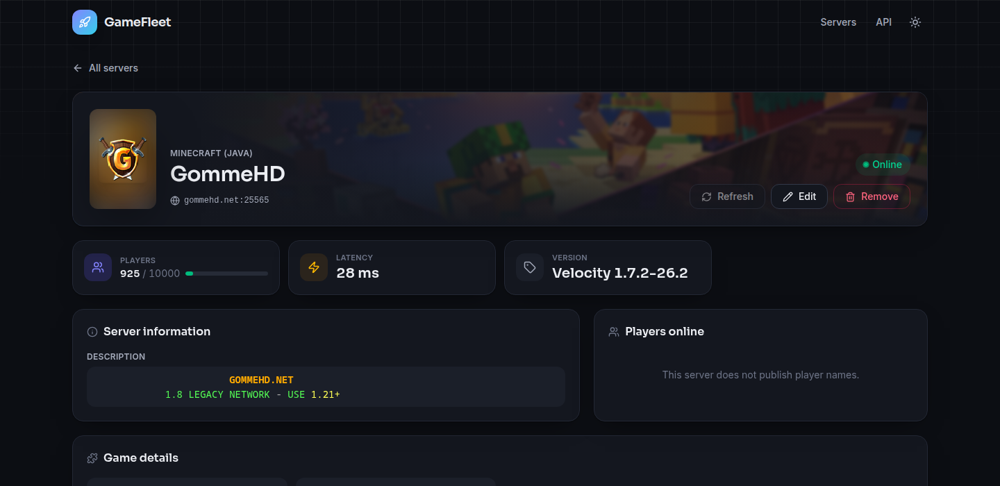

# GameFleet

A small, self-hosted dashboard for your game servers. It shows which servers are up, who is playing, and whatever else each game is willing to tell you: map, version, mods, in-game day, MOTD and more.



<details>
<summary>More screenshots</summary>




</details>

## Features

- One dashboard for all your servers, with search, per-game filters, status filter, sorting and grid/list views
- Live status, player counts and player names (where the game publishes them), refreshed every 30 seconds
- Per-game details: Minecraft MOTD and server icon, ARK day/cluster/mods, Factorio evolution and tags, raw A2S rules for Steam games
- Game servers running in Docker on the same host are found automatically, can be started, stopped and restarted from the dashboard, and show CPU, memory, data and world size
- Login with users from an environment variable
- Real game artwork, downloaded once and cached locally by the backend
- Light and dark theme
- FastAPI backend with OpenAPI docs, SvelteKit frontend, PostgreSQL storage
- Ships as two Docker images

## Supported games

| Game | How it is queried | Notes |
|------|-------------------|-------|
| Minecraft (Java) | Server list ping | MOTD, icon, version, players, Forge mods |
| Minecraft (Bedrock) | Raknet ping | MOTD, version, players, game mode, map |
| Factorio | RCON | Factorio has no public query protocol. Start the server with `--rcon-port` and `--rcon-password` and enter them when adding the server. |
| Satisfactory | Dedicated server HTTPS API | Session, tech tier, game phase, tick rate |
| ARK: Survival Evolved | Steam A2S (query port, default 27015) | Day, mods, PvE/PvP, cluster, BattlEye |
| ARK: Survival Ascended | Epic Online Services | Official and Nitrado/public servers are found automatically via ARK's server lists. Private servers need RCON (`ListPlayers`). |
| Valheim, Rust, 7 Days to Die, Palworld, Project Zomboid, Enshrouded, V Rising, Conan Exiles, DayZ, Counter-Strike, Team Fortress 2, Garry's Mod, Unturned | Steam A2S | Default query ports are prefilled per game; override the query port if your server uses a different one. |
| Any other Steam game | Steam A2S | Pick "Steam game (A2S)" and enter the query port. |

The **port** of a server is always the port players connect to. The query port and RCON port only need to be set when they differ from the game's defaults, which the add-server form shows.

## Servers in Docker on the same host

With the Docker socket mounted into the backend (the compose files do this), GameFleet looks at every container on the host and recognises game servers in three ways, most reliable first:

1. **Labels** on the container are authoritative and always imported: `gamefleet.game=factorio` is enough; `gamefleet.name`, `gamefleet.port`, `gamefleet.query_port`, `gamefleet.rcon_port`, `gamefleet.rcon_password` / `gamefleet.rcon_password_env` / `gamefleet.rcon_password_file`, `gamefleet.data_path` and `gamefleet.world_path` refine it, `gamefleet.ignore=true` hides a container.
2. **Known images** (`itzg/minecraft-server`, `factoriotools/factorio`, `lloesche/valheim-server`, `thijsvanloef/palworld-server-docker`, `wolveix/satisfactory-server`, `cm2network/*` and more, see `models/container_catalog.py`) are imported automatically when `DOCKER_AUTO_IMPORT` is on. The catalog also knows where each image keeps its data and how it is given its RCON password, so a Factorio or Minecraft container needs no configuration at all.
3. **Names and ports** only produce a suggestion: a container called `my-valheim` or one that exposes 34197/udp shows up in the "Containers on this host" panel with a game dropdown and an Import button.

Ports are translated to what is reachable from the host (published port, or the container's own address when nothing is published), the container name is the link, so `docker compose up` recreating a container keeps it attached. Imported servers get a **Host container** panel with start/stop/restart, CPU and memory (one Docker stats sample per refresh, cached for 10 s), and the size of the data and world directories (`du` inside the container, cached for 5 min). Removing an imported server hides the container from discovery; it can be shown again from the panel.

Backups and rollback are planned on top of this: every imported server already records its persistent paths and volumes, and stop/start are the primitives a restore needs.

## Quick start (Docker)

You need Docker and a PostgreSQL database. The compose file runs the backend with host networking, so any Postgres reachable from the host works; `make db` starts one from the same compose file if you have none.

```bash
git clone https://github.com/H3xaChad/GameFleet.git
cd GameFleet
cp .env.example .env      # set DB_PASSWORD and GAMEFLEET_USERS (and anything else you want to change)
make db                   # optional: PostgreSQL 16 container using the DB_* values from .env
make up                   # builds and starts backend + frontend in the background
```

- Dashboard: http://localhost:3000 (log in with a user from `GAMEFLEET_USERS`)
- API docs: http://localhost:8000/swagger

The database schema is created and upgraded automatically when the backend starts. Game artwork is cached in the `gamefleet-assets` volume.

Prebuilt images are published as `h3xachad/gamefleet-backend` and `h3xachad/gamefleet-frontend`; see `docker-compose-example.yml` for using them.

## Configuration

One `.env` in the repository root configures everything: `docker-compose.yml` reads it, and the backend loads it when run natively. Real environment variables take precedence.

| Variable | Default | Purpose |
|----------|---------|---------|
| `DB_HOST`, `DB_PORT`, `DB_NAME`, `DB_USER`, `DB_PASSWORD` | `localhost`, `5432`, `gamefleet`, `gamefleet`, – | PostgreSQL connection; `make db` creates its database from the same values |
| `DATABASE_URL` | – | Full SQLAlchemy URL (`postgresql+asyncpg://...`) that overrides the `DB_*` values |
| `BACKEND_PORT` | `8000` | Backend port (host network) |
| `FRONTEND_PORT` | `3000` | Published frontend port |
| `FRONTEND_TARGET` | `node-server` | `node-server` or `nginx-server` image variant |
| `ASSET_CACHE_DIR` | `data/assets` | Where the backend stores downloaded game artwork |
| `GAMEFLEET_USERS` | – | Login users, `name:password,name2:password2`. Passwords in plain text or scrypt hashes from `make hash` (`$` becomes `$$` in `.env`). Empty disables login. |
| `GAMEFLEET_SECRET` | random per start | Signs login tokens (30 days, `GAMEFLEET_SESSION_HOURS`); set it so logins survive restarts |
| `DOCKER_AUTO_IMPORT` | `true` | Import containers with known game-server images automatically |
| `DOCKER_SERVER_ADDRESS` | `127.0.0.1` | Address imported containers are queried at (the LAN IP or `host.docker.internal` when the backend is not on the host network) |
| `DOCKER_DISCOVERY_INTERVAL` | `60` | Seconds between background discovery runs, `0` disables |
| `UV_LINK_MODE` | – | Set to `copy` if your uv cache and project live on different filesystems |

## Development

Prerequisites: [uv](https://docs.astral.sh/uv/), [pnpm](https://pnpm.io/), Docker (for Postgres), Python 3.14, Node 24. uv downloads Python 3.14 automatically if it is missing; the pnpm version is pinned in `package.json` (corepack).

```bash
make install        # uv sync + pnpm install
make db             # PostgreSQL 16 container with the DB_* values from .env (or point .env at any Postgres)
make backend        # API with auto-reload on http://localhost:8000
make frontend       # SvelteKit dev server on http://localhost:3000
```

`make check` runs svelte-check and ESLint on the frontend and import-checks the backend. `make swagger` regenerates `frontend/src/lib/api/Api.ts` from the running backend's OpenAPI schema; run it whenever you change API models. `GAMEFLEET_API_URL` at build time points the frontend at another backend (`GAMEFLEET_API_URL=http://localhost:8010 pnpm dev`).

Append `?theme=light` or `?theme=dark` to any URL to force a theme (useful for sharing links).

### Adding a game

1. Add a value to `GameServerType` and a `GameSpec` (protocol, default port, query-port rule) to `GAME_CATALOG` in `backend/src/gamefleet_backend/models/game_server_type.py`.
2. Steam games only need their app id in `STEAM_APP_IDS` (`services/game_asset_service.py`) for artwork; other games can list explicit image URLs there.
3. Add the display label in `frontend/src/lib/games.ts` and run `pnpm swagger`.

Games that speak A2S need no query code. Anything else gets a module in `backend/src/gamefleet_backend/lib/query/` returning one of the `*ServerInfo` models.

### Project layout

```
backend/   FastAPI + SQLModel. api/ (routes), auth.py (users, tokens), services/ (live info, docker,
           discovery, assets), lib/query/ (one module per protocol), models/ (API models, game and
           container catalogs), db/
frontend/  SvelteKit (static adapter) + Tailwind v4. lib/components/, routes/main, routes/server/[id]
docs/      screenshots
```

## Make targets

`make help` lists everything. Native development: `install`, `db`, `backend`, `frontend`, `check`, `swagger`, `hash` (password hash for `GAMEFLEET_USERS`). Docker: `up`, `down`, `restart`, `logs` (`S=backend` for one service), `ps`, `shell`, `build`, `release` (build, tag and push both images to `DOCKER_REPO`, default `h3xachad`), `clean` (also deletes the artwork cache; the database volume is kept).

Images are tagged with the project version from `backend/pyproject.toml`; override with `make release VERSION=x.y.z`.

## License

See [LICENSE](LICENSE).
