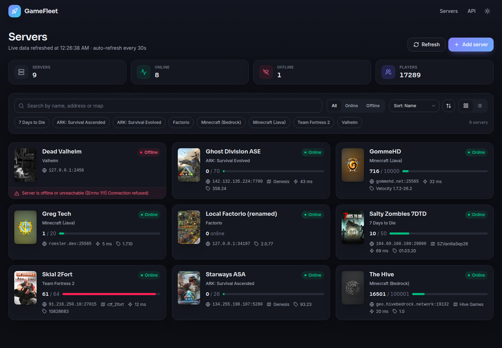
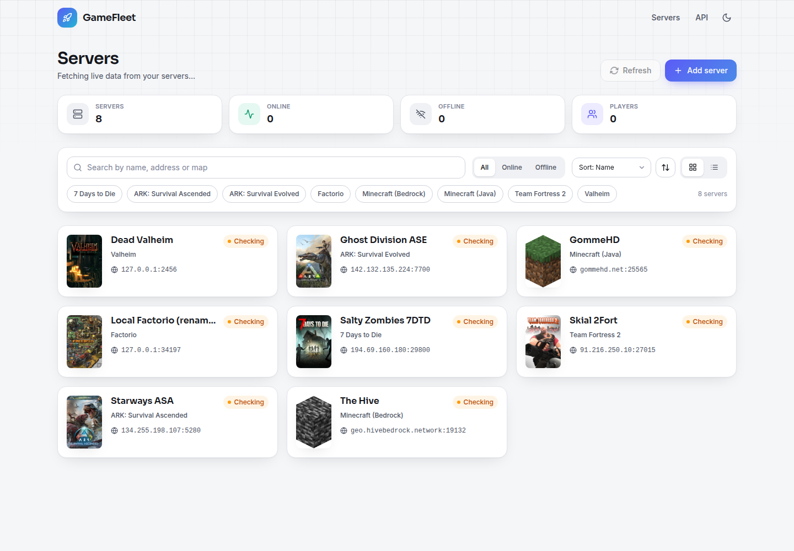
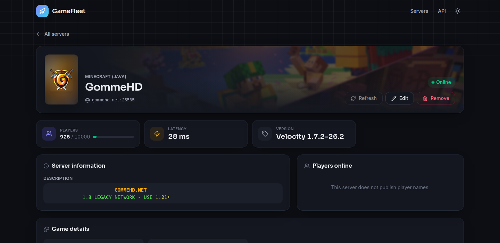

# GameFleet

**Your game servers, one control center.** GameFleet is a self-hosted dashboard that shows every server you run or play on at a glance: who is online, which version and map, which modpack, how much CPU and memory it takes. Servers running in Docker on the same machine are found on their own and can be started, stopped and restored from their backups.

The goal is a complete game server management platform for your own hardware, the kind of panel commercial hosts like Nitrado offer: deploy new servers in a few clicks, change their settings, update them and keep their worlds safe, without renting anything.



<details>
<summary>More screenshots</summary>




</details>

## Quick start

Save this as `docker-compose.yml`, change the `change-me` values and run `docker compose up -d`:

```yaml
services:
  backend:
    image: lordlayer/gamefleet_backend:latest
    restart: unless-stopped
    environment:
      DB_HOST: postgres
      DB_PASSWORD: change-me
      GAMEFLEET_USERS: admin:change-me # name:password, comma separated for more
      GAMEFLEET_SECRET: change-me # any long random string; keeps logins valid across restarts
      DOCKER_SERVER_ADDRESS: host.docker.internal
    extra_hosts:
      - "host.docker.internal:host-gateway"
    volumes:
      - gamefleet-assets:/app/data/assets
      # Lets GameFleet find and control game servers in Docker on this host. Remove it to only monitor.
      - /var/run/docker.sock:/var/run/docker.sock
    depends_on:
      - postgres

  frontend:
    image: lordlayer/gamefleet_frontend:latest
    restart: unless-stopped
    environment:
      BACKEND_URL: http://backend:8000
    ports:
      - "3000:3000"

  postgres:
    image: postgres:16
    restart: unless-stopped
    environment:
      POSTGRES_DB: gamefleet
      POSTGRES_USER: gamefleet
      POSTGRES_PASSWORD: change-me # same as DB_PASSWORD
    volumes:
      - gamefleet-postgres:/var/lib/postgresql/data

volumes:
  gamefleet-assets:
  gamefleet-postgres:
```

Open http://localhost:3000. Visitors see the servers you mark as public; sign in to add, edit and control servers. The database schema is created on the first start.

**From source:** clone the repository, `cp .env.example .env`, adjust it, then `make db` (optional Postgres container) and `make up`.

## Features

- Live status, players, version, map, MOTD, mods and per-game details for 20+ games, refreshed every 30 seconds
- Search, filters, sorting, grid and list view, light and dark theme, real game artwork
- Public by default: visitors see the servers you mark as public, signing in unlocks the rest
- Game servers in Docker on the same host are recognised automatically: start, stop, restart, CPU, memory and disk usage
- Modpack detection for Minecraft (Modrinth, CurseForge, FTB, GTNH)
- Restore from the backups your servers already make, or from an uploaded file

## Supported games

| Game | Queried through | Notes |
|------|-----------------|-------|
| Minecraft Java | Server list ping | MOTD, icon, version, players, Forge mods |
| Minecraft Bedrock | RakNet ping | MOTD, version, players, game mode |
| Factorio | RCON | Needs `--rcon-port` and `--rcon-password`; read from the container when it runs in Docker |
| Satisfactory | Dedicated server API | Session, tech tier, game phase, tick rate |
| ARK: Survival Evolved | Steam A2S | Day, mods, PvE/PvP, cluster |
| ARK: Survival Ascended | Epic Online Services | Official and public servers are found through ARK's server lists; private ones need RCON |
| Valheim, Rust, 7 Days to Die, Palworld, Project Zomboid, Enshrouded, V Rising, Conan Exiles, DayZ, Counter-Strike, Team Fortress 2, Garry's Mod, Unturned, any other Steam game | Steam A2S | Query ports are prefilled per game |

The port of a server is always the one players connect to; query and RCON ports only need to be set when they differ from the game's defaults.

## Servers in Docker

With the Docker socket mounted, GameFleet reads every container on the host and recognises game servers from their image (`itzg/minecraft-server`, `factoriotools/factorio`, `wolveix/satisfactory-server`, `lloesche/valheim-server` and many more), falling back to container names and ports as a suggestion. Nothing to label or configure: data paths, ports and RCON passwords are read from the container.

**Import from Docker** on the dashboard adds all running game servers at once; single containers, stopped ones included, can be imported from the host panel. Many instances of one game sharing a port are fine: starting one whose port is taken offers to stop the other first.

## Backups

GameFleet restores from the backups your servers already write and lists them on each server's page:

| Game | Backups found in |
|------|------------------|
| Minecraft Java | `backups/` (ServerUtilities, FTB Backups), `simplebackups/`, `backup/` (Textile Backup) |
| Minecraft Bedrock | `backups/` (`.mcworld` or archives) |
| Factorio | the autosaves in `saves/` |
| Satisfactory | `/config/backups` and the server's save folder |
| Valheim | `/config/backups` (lloesche) or `/home/steam/backups` (mbround18) |
| ARK | timestamped `.ark` copies in `SavedArks` |

Other folders with "backup" in their name next to the server's data are searched too. A running server is stopped for the restore and started again afterwards, and a copy of the current world can be kept first so every restore can be undone. A file uploaded from your computer is checked before anything is touched; make sure it matches the server's game version and modpack.

## Configuration

Set these in `.env` (from source) or in the compose file:

| Variable | Default | Purpose |
|----------|---------|---------|
| `GAMEFLEET_USERS` | – | Logins as `name:password,name2:password2`; `make hash` creates a password hash (write `$` as `$$` in `.env`) |
| `GAMEFLEET_SECRET` | random | Signs login tokens; without it every restart logs everyone out |
| `DB_HOST`, `DB_PORT`, `DB_NAME`, `DB_USER`, `DB_PASSWORD` | this host, `5432`, `gamefleet`, `gamefleet`, – | PostgreSQL connection |
| `FRONTEND_PORT`, `BACKEND_PORT` | `3000`, `8000` | Published ports (from source); browsers only need the frontend |
| `DOCKER_SERVER_ADDRESS` | `host.docker.internal` | Address GameFleet reaches game servers in Docker at |
| `GAMEFLEET_DEV` | `false` | Development mode: API docs at `/swagger`, verbose logs; not for production |

## Development

Needs [uv](https://docs.astral.sh/uv/), [pnpm](https://pnpm.io/) and Docker. `make install`, `make db`, then `make backend` and `make frontend` in two terminals (API on port 8000, dashboard on 3000, both with hot reload). `make check` type-checks and lints; `make swagger` regenerates the API client after model changes.

## License

See [LICENSE](LICENSE).
